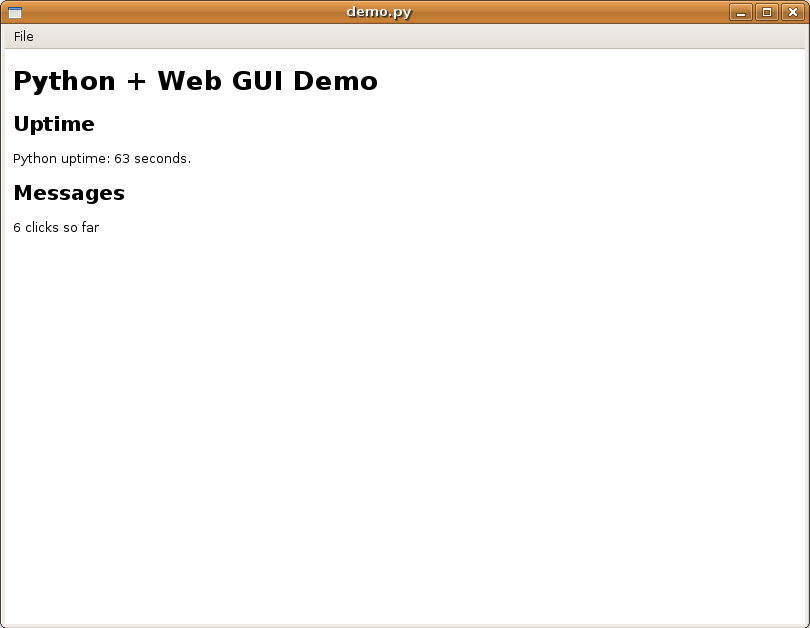

# 采用HTML(5)建立Python图形界面的方法

...现在已经支持 [Python GtkMozEmbed](http://www.pygtk.org/pygtkmozembed/class-gtkmozembed.html) 及 [PyWebKitGtk](http://code.google.com/p/pywebkitgtk/)！


**版本：** r38 2013-03-21 15:01:53 -0600

**作者：** David Baird

**作者联系方式：** [dhbaird@gmail.com](mailto:dhbaird@gmail.com)

**原文地址：** [http://www.aclevername.com/articles/python-webgui/](http://www.aclevername.com/articles/python-webgui/)

**中文译者：** Peng Hailin

**译者联系方式：** [unisko@gmail.com](mailto:unisko@gmail.com), [https://xfoss.com/](https://xfoss.com)

内容目录

- [历史](#本文档的历史)
- [概览](#概述)
- [动机](#动机)
+ [于单一线程中启用工具包（Launching the Toolkit in a Separate Thread）](#于单一线程中启用工具包)
    - [启用 GTK](#启用gtkgimp-toolkit)
+ [消息传递](#消息传递message-passing)
    - [关于消息传递](#关于消息传递)
    + [GTK下的消息传递](#gtk下的消息传递)
        - [异步 GTK 消息](#异步的gtk消息)
        - [同步 GTK 消息](#同步的gtk消息)
    - [WebKit 下的消息传递](#webkit下的消息传递)
    - [Mozilla(GtkMozEmbed)下的消息传递](#mozillagtkmozembed下的消息传递)
+ [修正各种组件，以实用化（Polishing Things Up）](#将这些东西加以修正)
    - [加入退出封装器（The Quit Wrapper）](#关于退出的封装器the-quit-wrapper)
+ [一个完整示例](#一个完整的示例)
    - [预备知识](#准备工作)
    - [JavaScript 代码](#javascript代码)
    - [HTML 代码](#html代码)
    - [Python 代码](#python代码)
    - [截图](#屏幕截图)
+ [其它资源](#资源)

## 本文档的历史

2013-03-21 21:02:33 UTC David Baird <[dhbaird@gmail.com](mailto:dhbaird@gmail.com)>

> 来自 [http://webhostinggeeks.com/](http://webhostinggeeks.com/) 的 Anja Skrba 已将本文翻译为 [塞尔维亚-克罗地亚语](http://science.webhostinggeeks.com/python-gui)。

2009-10-25 22:29:24 UTC David Baird <[dhbaird@gmail.com](mailto:dhbaird@gmail.com)>

> 对代码进行了重构，实现对 Webkit 或 GtkMozEmbed 的自动侦测，并利用所发现的引擎。现在还使用了标准库函数 `os.paht.abspath` 及 `urllib.pathname2url`，取代手工尝试生成正确的路径与URLs的方式。

2009-06-21 13:30:57 UTC David Baird <[dhbaird@gmail.com](mailto:dhbaird@gmail.com)>

> 通过使用 `asynchronous_gtk_message`, 而不再使用 `synchronous_gtk_message`，修正了 `kill_gtk_thread()` 与 `my_quit_wrapper()`。（感谢 Tim Kersten 指出这一点）。

2009-05-16 07:36:37 UTC David Baird <[dhbaird@gmail.com](mailto:dhbaird@gmail.com)>

> 我（作者）更新了此文档，加入了对 GtkMozEmbed 的说明。作者重写了示例代码，同时提供了对 GtkMozEmbed 与 PyWebKitGtk 的支持。

2009-05-16 06:27:53 UTC David Baird <[dhbaird@gmail.com](mailto:dhbaird@gmail.com)>

> 修正了一些拼写错误（感谢 [Emend](http://emend.appspot.com/sites/www.aclevername.com)  -- 一个非常棒的语法问题工具，的 [John Tantalo](http://www.johntantalo.com/) ([Twitter](http://twitter.com/emendapp) 的指正）。我还采纳了一项使用条件变量（to use condition varibles）的建议（来自 [Y Combinator News](http://news.ycombinator.com/item?id=587180)）。还将`execute`函数，重命名作更为恰当的的`worker`了。

2009-05-16 02:22:09 UTC David Baird <[dhbaird@gmail.com](mailto:dhbaird@gmail.com)>

> 对文档进行了更新，将 JavaScript 的 `send()` 函数，移入到一个名为 `ipc.js` 的单独文件中; 先前的 `send()` 是通过使用 WebKit 的 `.execute_script()` 方法，加以注入的。通过对 `send()` 的此种重构，就可以更容易的使用 gtkmozembed(Mozilla) 引擎了，该引擎的 JavaScript 注入方式有些许的差异，该引擎是 WebKit 的一种替代。

2009-04-22 David Baird <[dhbaird@gmail.com](mailto:dhbaird@gmail.com)>

> 第一版，对如何嵌入 WebKit 及 Python 下的消息交换进行了解释。

## 概述

在这个 howto 文档中，我（作者）对以下概念进行了解释：
1. 如何在某个单一线程中启用某种 GUI 工具包，以及怎样与该线程进行通信的问题。
2. 怎样在该 GUI 中嵌入某种 web 浏览器，以及如何在不使用套接字的情况下，与此嵌入的 web 浏览器进行的问题。通过不再使用套接字，我们就不必担心套接字安全方面的问题，同时也不必担心套接字分配的问题（注意：经由套接字通信仍然是可行的，但在除非确实打算用到的情况下，可以不必使用套接字通信）。此方案下完全无需 web 服务器（除非你为了某种原因，而特别想要使用某种 web 服务器）。也就是说，为了实现 Python 下的通信，我们将有着类 AJAX 及类似 [AJAX-Push/Comet](http://en.wikipedia.org/wiki/Comet_(programming))，而无需切实务必使用 AJAX 技术。

此 howto 文档，是关于采用 HTML 及相关的 web 技术（JavaScript、CSS、JSON等等），来建立一种以 Python 编写的独立应用的文档。

此 howto 文档不是关于：
- 不是有关运行某种 web 服务器的，或是关于如何使用某种 web 框架的。你无需运行某种 web 服务器（如 tomcat、nginx等），甚至无需了解如何运行某种 web 服务器来使用本文档。

## 动机

过去数年来，我一直在尝试着构建一些图形用户界面。但每次我都以失望告终。我所遭遇到主要的令人沮丧的因素，有以下两个：

- 工具包锁定（Toolkit lock-in）。各种工具包都有着其自己的 *main loops* 与事件处理框架。比如，在打算编写一个集成了套接字的 GUI 时，就很难使用上 `select` 函数。`select` 的使用，需要程序员编写自己的主循环，这就会与提供了预包装主循环的工具包发生冲突。

解决方法：生成两个线程（Spawn two threads）。一个线程只用于 GUI 工具包。另一个线程则运行自己的定制主循环（your own personalized main loop）。两个线程之间通过相互发送消息，进行通信（比如，通过使用线程安全的FIFOs或队列，by using thread-safe FIFOs or queues）。

> 关于线程与GUIs的注意点：重要的是要严格遵循某种消息传递模型：通常不能保有与GUIs函数进行通信的多个线程，因为这将导致X11库文件出现段错误; 因此只能有一个线程被赋予直接管理GUI的权力。所有其它线程可通过向该赋权线程发送消息的方式，间接地对GUI进行管理（strictly follow a message passing model. you generally CANNOT have multiple threads accessing GUI functions lest X11 libaries shall segfault; Thus, exactly one thread should be blessed to manage the GUI directly. All other threads can manage the GUI indirectly by sending messages to this one blessed thread）。我（作者）将在本文档解释如何完成这种做法。

- 表达方面的问题（Expression）。我发现在各种工具包中都很难描述清楚一些想法，因为我发现很难对各种GUI工具包所采用的不同结构加以具象化和掌握（I found it hard to express ideas in toolkits because I found it hard to visualize and understand the structures which underlie GUI toolkits）。就算一些工具包已有集成了构建其GUIs的XML支持，但我（作者）仍然觉得需要很多额外的学习，同时缺少了HTML所能提供的灵活性。在采用并体会到HTML的方便一段时间后，我（作者）就开始思考：使用HTML来构建GUIs会怎样呢？

解决办法：将某种web浏览器嵌入到GUI中。那么，就拥有了使用某种工具包来创建一些基本的GUI元素（如菜单与菜单项目）所带来的灵活性，又可以使用web浏览器来完成所有繁重事务（Thus, you have the felxibility of using a toolkit for creating a few basic things(such as menus and menu items), but you can use the web browser to do all the heavy lifting）。这种做法提出了一个额外的问题，将在本文档中进行讨论：怎样在web浏览器与定制的主循环之间进行消息的传输。HTML结构下的概念就是文档对象模型（Document Object Model, DOM），DOM有着一种一对一的回到HTML的映射关系。我（作者）认为这是一种易于掌握和操纵的模型，同时它也是强大的。

我（作者）是在与各种涉及到套接字、串口、音频数据、MIDI数据及GUIs的事件处理循环打了交道后，最终得出这些结论的。我（作者）曾采用一些MVC（Model View Controller, 模式视图与控件）方法来完成GUI设计，并感受到这些方法带来的帮助，但仍然不能令到作者感到满意。最终在进行一些简单的基于web应用的开发时，才发现一些看起来管用的东西。基于web的应用有着十分严格的GUI（运行在远端）与代码（运行于服务器）的分离。因此主要代码自身无需受GUI工具包的限制。或者至少不会有这种感觉（Thus, your main code does not have to be locked into the GUI toolkit, per se. Or at least, it does not feel as such）。

HTML是一项良好的技术。其集成了以下的诸多其它技术：

- CSS
- JavaScript(ECMAScript)
- XML DOM
- SVG
- MathML
- HTML5 Canvases
- 诸如jQuery等的JavaScript扩展
- 等等很多其它技术，如 Bootstrap、Material等，而且还在增长

HTML是高度可组合的/组装的，这就意味着可将许多HTML既有设计经由拷贝粘贴放在一起（HTML is very composable, meaning it is easy to copy-and-paste HTML designs together）。而对于各种GUI工具包的既有设计，要通过拷贝粘贴将其放在一起，我认为是较难做到的，这就令到HTML在这一点上是优于各种GUI工具包的。同时对于构建高质量的HTML文档来说，已可公开获取到许多模板及线上资源。

就算缺少应用逻辑，我们也是可以对某个基于HTML的用户界面进行修改。这意味着GUI设计过程，不必是与主应用逻辑的编写紧密耦合的（It is possible to tinker with an HTML-based user interface, even if the underlying application logic is missing. This means that the process of designing the GUI does not have to be tightly coupled to writing the main application logic）。

HTML的另一益处，在于HTML对于那些非程序员是开放的。在用户界面是基于HTML的情况下，现在的许多web设计师，就可在应用用户界面设计上有所作为了。

## 于单一线程中启用工具包

### 启用GTK（GIMP ToolKit）
 
这方面可能是本文档中最简单的部分了：在其本身线程中启用GTK，这样做就令到我们的主线程对于部署我们自己的定制主循环可用了（launching GTK in its own thread, thus leaving our main thread available for implementing our own personalized main loop）：

```python
import gtk
import thread

gtk.gdk.threads_init()
thread.start_new_thread(gtk.main, ())

# Yes, it really is that easy.  GTK is now running in its own thread,
# waiting for us to send messages to it.
```

> 译者注：上面的代码，在virtualenv环境中运行，先会出现无法进行`pip install PyGtk`安装的错误，此时需要全局安装`sudo apt-get install python-gtk2.0`，然后修改`venv/bin/activate`脚本，在脚本后面加入下面这些行：

```bash

VENV_DIST_PACKAGES=$VIRTUAL_ENV"/lib/python2.7/dist-packages"

if [ -d $VENV_DIST_PACKAGES ]; then
    :
else
    mkdir $VENV_DIST_PACKAGES
fi;

CURRENT_DIR=`echo $PWD`

cd $VENV_DIST_PACKAGES

if [ -d $VENV_DIST_PACKAGES"/webkit" ]; then
    :
else
    ln -s /usr/lib/python2.7/dist-packages/webkit/
fi;

if [ -d $VENV_DIST_PACKAGES"/glib" ]; then
    :
else
    ln -s /usr/lib/python2.7/dist-packages/glib/
fi;

if [ -d $VENV_DIST_PACKAGES"/gobject" ]; then
    :
else
    ln -s /usr/lib/python2.7/dist-packages/gobject/
fi;

if [ -d $VENV_DIST_PACKAGES"/gtk-2.0" ]; then
    :
else
    ln -s /usr/lib/python2.7/dist-packages/gtk-2.0
fi;

if [ -e $VENV_DIST_PACKAGES"/pygtk.pth" ]; then
    :
else
    ln -s /usr/lib/python2.7/dist-packages/pygtk.pth
fi;

if [ -e $VENV_DIST_PACKAGES"/pygtk.py" ]; then
    :
else
    ln -s /usr/lib/python2.7/dist-packages/pygtk.py
fi;

if [ -d $VENV_DIST_PACKAGES"/cairo" ]; then
    :
else
    ln -s /usr/lib/python2.7/dist-packages/cairo
fi;

cd $CURRENT_DIR

export PYTHONPATH=$PYTHONATH$VENV_DIST_PACKAGES
```

请继续阅读“消息传递（message passing）”部分，了解下一步要做的事情。
 
## 消息传递（Message Passing）

### 关于消息传递

消息传递，是指进程通信的方式。与人类通过相互交谈或是各自间写纸条进行交流的方式类似，计算机程序则是通过消息传递方式彼此通信的。套接字与管道（pipes, pipeline， 比如`ls -l | less`）是消息传递技术的主要实例。共享内存也可用于消息传递。

以函数或对象方式的编程，也是某种类型的消息传递。在此情形下，对某个函数或方法的调用，就相当于是向你的程式或程式中的某个对象发送了一个消息。基本上，你的程式就是在与自己进行着通信。但那仍然是为消息传递。就像是人们有时候喜欢自说自听一样（至少我会这样）。

某些编程语言库具有某些特殊的队列，可用于在多线程应用中线程之间的消息传递。而某些语言，比如Erlang或[Temite Scheme](http://code.google.com/p/termite/)，则有着根深蒂固的消息传递机制，如未能使用这些特性，你将发狂！

### GTK下的消息传递

下面我（作者）将就GTK与你的定制主循环之间的消息传递进行说明。*这里讲的不是GTK内部的消息传递*（比如GTK组件（GTK Widgets）之间的消息传递--对于GTK内部的消息传递，你就要阅读GTK文档了）。

GTK有着一个名为“空闲循环（idel loop）”，该空闲循环就是你所能够与GTK的主循环进行交互的了。GTK有着一个名为 `idle_add` 的特殊函数，该函数令到我们可以加入消息，以便在该空闲循环中进行处理。这里将就两种类型的消息进行描述：

1. 异步消息（Asynchronous messages）

    - 是那些插入到GTK空闲循环的消息，但并不关心是否对此有所响应。

2. 同步消息（Synchronous messages）

    - 那些插入到GTK空闲循环的消息，但对是否得到响应，是在意的。

在Python这一编程语言中，函数是头等公民，可像一般数据那样进行传递。那么消息就**实际上是一个我们注入到GTK空闲循环中的函数的引用（或者说函子（functor））了**。GTK的空闲循环仅仅将对该函数进行调用/执行。而在C语言中，这就类似于将某个函数指针，放入到另一循环进行出列处理操作的队列中，并于随后调用与那个函数指针所关联的函数（In C, this is similar to putting a function pointer into a queue which another loop dequeues and then calls the function associated with that function pointer）。

#### 异步的GTK消息

下面是Python中异步GTK消息处理的一个技巧。顺便说一下，如果你对下面的代码感到疑惑，就应该研究一下Python中的*变量参数（varible arguments）*与*关键字参数（keyword arguments）*了。你也会想要研读一下有个Python中*解包元组（tuple unpacking）*方面的内容。你还可能想要了解有关*高阶函数（hight order functions）*方面的内容，高阶函数是函数式编程中的一个概念（很抱歉，这方面需要掌握的内容确实很多）。

```python
import gobject

# This is a function which takes a function as an argument and
# returns yet another function (this is what higher order functions
# are all about!).  (Side note: this can be invoked/applied with
# Python's decorator syntax, '@', if you so desire.):

# 这是一个将某个函数作为参数的函数，同时又返回另一个函数（这就是所谓
# 的高阶函数了）。（边注：可使用Python的修饰符语法，对该函数进行引用，
# 如你确实想要这么做的话）。
def asynchronous_gtk_message(fun):

    def worker((function, args, kwargs)):
        # Apply is a function that takes a function as its first
        # argument and calls it with positional argument taken
        # from "args" and keyword arguments taken from "kwargs":

        # apply 是一个Python的内建函数，将一个函数作为其第一个参数，并
        # 从`args`中以位置次序取得参数、从`kwargs`中取得关键字参数，来
        # 调用该函数。
        apply(function, args, kwargs)

    # This is a special type of function known as a "closure"
    # (although it is not quite as advanced as a closure in Lisp
    # or Ruby.  Challenge question: do you know why?).  In C++,
    # a class-based functor which defines `operator()` 
    # (or `Boost.Lambda`) is the closest you can get to a closure:

    # 这是一种被称为“闭包”的特殊函数（尽管Python中的闭包与Lisp或Ruby中
    # 的比起来不那么高级。提个问题：你知道为什么这么说吗？）。在C++中，与
    # 闭包最接近的，就是一个定义了`operator()`（或者`Boost.Lambda`）的
    # 基于类的函子了：

    def fun2(*args, **kwargs):
        # "worker" is none other than the function just defined
        # above (with "def worker"):
        gobject.idle_add(worker, (fun, args, kwargs))

    # Here, the closure is returned and must be called at some 
    # later point in the program:

    # 这里返回了该闭包，同时必定会在在程式后面的某个地方对其进行调用。
    return fun2
```

上面的代码有着太多的注释，下面是将所有注释去除掉了的同样代码（一些人可能发现这样更易于阅读了）：

```python
import gobject

def asynchronous_gtk_message(fun):

    def worker((function, args, kwargs)):
        apply(function, args, kwargs)

    def fun2(*args, **kwargs):
        gobject.idle_add(worker, (fun, args, kwargs))

    return fun2
```

尽管这里只有几行代码，但要理解这几行代码，却是需要掌握一些相当深奥的编程概念。不过这段代码简洁并富有表现力，同时相对较难引入bugs（因为它是这么的简单）。

下面是一个使用`asynchronous_gtk_message`函数来对某个运行在GTK中的web浏览器控件（a web browser widget, 这里特定于WebKit）进行操作的示例：

``` python
browser = ... # read about synchronous_gtk_message below to see what goes here
...
asynchronous_gtk_message(browser.execute_script)(
    'alert("oops")')

# or, alternatively:
async_execute_script = asynchronous_gtk_message(
    browser.execute_script)
async_execute_script('alert("oops")')
```

注意到这里的`asynchronous_gtk_message`并不会做任何实际上的事情。所有它所完成的，就是返回一个特别的函数（还记得上面的闭包吧（remember the closure from above?））。且该函数就是在我们打算*确实*要发送一个异步消息的时候，所必须调用的那个特殊函数。注意到我们是怎样忽略消息的返回值了吗？对的，那就是令到消息是为异步的地方，同时也使得程序运行更为快速了（Notice how we ignore the return value from the message? Well, that is what makes it asynchronus; And fast）。

#### 同步的GTK消息

那么在我们需要一个返回值的情况下，该怎么做呢？此时就需要一个同步消息了。这么说吧，我们发给GTK一个消息，告诉它“请创建一个新的GTK窗口，还要返回给我到那个新窗口的引用，以便我后面可以对那个窗口进行修饰（please create a new GTK window and give me back a reference to that new window so that I can embellish it later on）”。这正是同步消息所擅长的。同步消息需要更多时间去执行，因此你必须坐在那里等待返回值（当然是有一些诀窍可以绕过这种等待......，有另外的作者写的另外一片文章中讲到了这些窍门）：

```python
import time
import gobject

def synchronous_gtk_message(fun):

    class NoResult: pass

    def worker((R, function, args, kwargs)):
        R.result = apply(function, args, kwargs)

    # WARNING: I know the busy/sleep polling loop is going to 
    #   offend the sensibilities of some people.  I offer the 
    #   following justifications:
    #   - Busy/sleep loops are a simple concept: easy to
    #     implement and they work in situations where you
    #     may not have condition variables (like checking your
    #     email with fetchmail).
    #   - If you do use a synchronous message, it will probably
    #     complete very rapidly, thus very few CPU cycles will
    #     by wasted by this busy loop (thanks to the sleep).
    #   - You probably shouldn't be using synchronous messages
    #     very often anyhow.  Async is cooler :-)
    #   - If this code is anything bad, it is probably that the
    #     sleep() adds a bit of undesired latency before the 
    #     result can be returned.
    # If this still doesn't appeal to you, then keep reading
    # because I do this again with condition variables.

    # 警告：我明白这里的繁忙/睡眠轮询循环会冒犯到某些人的敏感神经。但我这
    #       么做的理由有下面这些：
    #   - 繁忙/睡眠循环是一个简单的概念：它们易于部署，同时在某些不具备
    #     条件变量的地方（比如使用`fetchmail`来坚持邮件时），繁忙/睡眠
    #     循环仍然能较好工作。
    #   - 如你确实使用的是同步消息，那么消息传递将很快完成，因此该繁忙
    #     循环只将浪费极少的CPU资源（归功于睡眠的采用）。
    #   - 总之，你不应过份频繁地使用同步消息。异步总是比较好的选择：-）
    #   - 如果说这里的代码有什么问题，那就是这里的`sleep()`带入了一点点
    #     于结果返回之前不想要的延迟了。
    # 如这样还不能令你满意，那么请继续阅读，后面我还用条件变量，再次
    # 对此进行了实现。
    def fun2(*args, **kwargs):
        class R: pass
        R.result = NoResult
        gobject.idle_add(callable=worker, 
                         user_data=(R, fun, args, kwargs))
        while R.result is NoResult:
            time.sleep(0.01)
        return R.result

    return fun2
```

当然，这比起异步下的情况要稍微复杂一些了。主要的区别在于`R.result`以及一个用于等待`R.result`去引用除开`NoResult`之外的其它结果的循环的加入。下面是一些人可能更喜欢的上述代码的紧凑格式：

```python
import time
import gobject

# Slightly more compact version of the above code:
def synchronous_gtk_message(fun):

    class NoResult: pass

    def worker((R, function, args, kwargs)):
        R.result = apply(function, args, kwargs)

    def fun2(*args, **kwargs):
        class R: result = NoResult
        gobject.idle_add(callable=worker, 
                         user_data=(R, fun, args, kwargs))
        while R.result is NoResult: time.sleep(0.01)
        return R.result

    return fun2
```

而假如你对上面的繁忙/睡眠循环不入眼，那么下面提供了使用[条件变量](http://docs.python.org/library/threading.html#condition-objects)的另一替代版本（If you're not keen on the busy/sleep loop above, here's another version that uses [condition variables](http://docs.python.org/library/threading.html#condition-objects) instead）。

```python
# non-busy/sleep version of the above code:
def synchronous_gtk_message2(fun):
    import threading

    def worker((R, condition, function, args, kwargs)):
        R.result = apply(function, args, kwargs)
        condition.acquire()
        condition.notify()
        condition.release()

    def fun2(*args, **kwargs):
        condition = threading.Condition()
        condition.acquire()
        class R: pass
        gobject.idle_add(worker, 
                         (R, condition, fun, args, kwargs))
        condition.wait()
        condition.release()
        return R.result

    return fun2
```

下面是不能运行另一选项，因此不要使用此做法：

```python
# non-working/broken version of the above code :-P
def synchronous_gtk_message3(fun):

    # This doesn't work for me.  Can anyone shed some light on 
    # this?
    #
    # Besides, 
    # http://library.gnome.org/devel/gdk/unstable/gdk-Threads.html
    # gives a warning that this may only work for X11 but not 
    # Win32:
    #
    #     GTK+ is "thread aware" but not thread safe - it 
    #     provides a global lock controlled by 
    #     gdk_threads_enter()/gdk_threads_leave() which
    #     protects all use of GTK+. That is, only one 
    #     thread can use GTK+ at any given time.
    #
    #     Unfortunately the above holds with the X11 backend 
    #     only. With the Win32 backend, GDK calls should 
    #     not be attempted from multiple threads at all.
    def fun2(*args, **kwargs):
        gtk.gdk.threads_enter()
        try:     x = apply(fun, args, kwargs)
        finally: gtk.gdk.threads_leave()
        return x

    return fun2
```

顺带下面给出了一个使用`synchronous_gtk_message`的示例：

```python
# Use synchronous messages here:
window = synchronous_gtk_message(gtk.Window)()
browser = synchronous_gtk_message(webkit.WebView)()

# Use asynchronous messages here:
asynchronous_gtk_message(window.set_default_size)(800, 600)
asynchronous_gtk_message(window.show_all)()
```

### WebKit下的消息传递

在与WebKit进行消息传递时，将存在两种类型的消息。这里不同于GTK，这两种WebKit消息，都是异步的：

1. 异步的发送（`web_send`/`execute_script`）
> 要从Python往WebKit发送一个消息，我们就要使用某个WebKit浏览器组件的`execute_script`方法。而名为`web_send`的函数，实际上是一个包装器，其会调用到`execute_script`方法。

2. 异步的接收（`web_recv`/`title_changed`）

> 而对于WebKit要发送一个消息给Python的情况，就需要做一下hack了。WebKit有着一个回调函数的特性，即是在所嵌入的web页面的“标题”发生改变时，将触发该回调函数。既然我们没有使用标题的其它更好理由，那么为何不对其进行劫持而将其用于消息传递呢？那么就可以将某个WebKit浏览器的`title-changed`这一事件提醒，连接到某个将标题值排入某个队列的函数。接着，就可以唤醒主循环，去检查该队列，或在该主循环空闲时，可对该队列进行轮询。这里有一个名为`web_recv`的包装器函数，与此队列进行交互（the WebKit browser features a callback that is triggered whenever the "title" of the embedded web page is changed. We are not using the title for anything better, so why not hijack it and use it for message passing? We can connect the "title-changed" event notification of a WebKit browser to a function which enqueues the title's value into a queue. Then, the main loop can be woken up to check the queue, or it can poll the queue at its own lesure. There is a wrapper function called "web_recv" which interfaces to this queue）。

下面就是用于发起一个浏览器并定义`web_send`与`web_recv`函数的代码：

```python
import Queue

import gtk
import webkit

def launch_browser(uri, echo=True):
    # WARNING: You should call this function ONLY inside of GTK
    #          (i.e. use synchronous_gtk_message)

    # 警告：次函数只应在GTK内部进行调用（比如，使用
   # `synchronous_gtk_message`对其进行调用）。

    window = gtk.Window()
    window.set_default_size(800, 600)

    # Optional (you'll read about this later in the tutorial):
    #
    # 下面这个是可选的（你稍后将在此教程读到这样做的目的）：
    window.connect('destroy', Global.set_quit)

    box = gtk.VBox(homogeneous=False, spacing=0)
    browser = webkit.WebView()

    # 这里要对一个webkit的设置进行设定，为载入本地文件, 以便后面
    # 能够载入本地的JavaScript、CSS框架

    settings = browser.get_settings()
    settings.set_property('enable-file-access-from-file-uris', 1)

    box.pack_start(browser, expand=True, fill=True, padding=0)

    window.add(box)
    window.show_all()

    # Note: All message passing stuff appears between these 
    # curly braces:

    # 注意：所有消息传递事务，都在这个花括号内：
    # {
    message_queue = Queue.Queue()

    def title_changed(widget, frame, title):
        if title != 'null': message_queue.put(title)

    browser.connect('title-changed', title_changed)

    def web_recv():
        if message_queue.empty():
            return None
        else:
            msg = message_queue.get()
            if echo: print '>>>', msg
            return msg

    def web_send(msg):
        if echo: print '<<<', msg
        asynchronous_gtk_message(browser.execute_script)(msg)
    # }


    browser.open(uri)

    return browser, web_recv, web_send

uri = 'http://www.google.com/'
browser, web_recv, web_send = synchronous_gtk_message(launch_browser)(uri)
```

接下来，在你的HTML/JavaScript中的某个地方，就需要定义出向Python发出一个修改HTML标题的`send()`函数。下面是一个我（作者）建议将其放入到名为“ipc.js”的文件中的示例：

```javascript
function send(msg) {
    document.title = "null";
    document.title = msg;
}
```

### Mozilla（GtkMozEmbed）下的消息传递

对GtkMozEmbed的处理，与WebKit类似，因此我建议你阅读上面的WebKit部分。这里我只着重强调WebKit与GtkMozEmbed的差异。

```python
import Queue

import gtk
#import webkit # <- webkit
import gtkmozembed # <- gtkmozembed
import urllib # <- gtkmozembed (for encoding JavaScript strings)

def launch_browser(uri, echo=True):
    # WARNING: You should call this function ONLY inside of GTK
    #          (i.e. use synchronous_gtk_message)

    window = gtk.Window()
    box = gtk.VBox(homogeneous=False, spacing=0)
    #browser = webkit.WebView() # <- webkit (obviously)
    browser = gtkmozembed.MozEmbed() # <- gtkmozembed

    # gtkmozembed only (for webkit, we use its 
    # .execute_script()):
    def inject_javascript(script):
        uri = 'javascript:%s' % urllib.quote(script + '\n;void(0);')
        browser.load_url(uri)

    window.set_default_size(800, 600)
    # Optional (you'll read about this later in the tutorial):
    window.connect('destroy', Global.set_quit)

    window.add(box)
    box.pack_start(browser, expand=True, fill=True, padding=0)

    window.show_all()

    # Note: All message passing stuff appears between these 
    # curly braces:
    # {
    message_queue = Queue.Queue()

    # webkit:
    #def title_changed(widget, frame, title):
    #    if title != 'null': message_queue.put(title)
    # gtkmozembed:
    def title_changed(*args):
        title = browser.get_title()
        if title != 'null': message_queue.put(title)

    #browser.connect('title-changed', title_changed) # <- webkit
    browser.connect('title', title_changed) # <- gtkmozembed

    def web_recv():
        if message_queue.empty():
            return None
        else:
            msg = message_queue.get()
            if echo: print '>>>', msg
            return msg

    def web_send(msg):
        if echo: print '<<<', msg
        # asynchronous_gtk_message(browser.execute_script)(msg) 
        # # <- webkit
        asynchronous_gtk_message(inject_javascript)(msg) 
        # <- gtkmozembed
    # }

    #browser.open(uri) # <- webkit
    browser.load_url(uri) # <- gtkmozembed

    return browser, web_recv, web_send

uri = 'http://www.google.com/'
browser, web_recv, web_send = synchronous_gtk_message(launch_browser)(uri)
```

......同时不要忘了“ipc.js”（也就是WebKit部分所讲到的）：

```javascript
function send(msg) {
    document.title = "null";
    document.title = msg;
}
```

## 将这些东西加以修正

### 关于退出的封装器（The Quit Wrapper） 

在退出某个多线程的应用时，需要能够通知*所有*进程予以终止。此外, Python在信号与线程上有着一个令人头痛的地方：完全不知道某个信号，比如`Ctrl-C/SIGINT`将会发送给哪个线程（Additionally, Python has an annoyance associated with signals and threads: you can never know which thread a signal, such as the `Ctrl-C/SIGINT`, will be sent to）。

我（作者）通过声明一个共享的全局`quit`变量，解决了上述两个问题。我随后安装了一个`SIGINT(Ctrl-C)`信号处理器，该信号处理器在被触发时，就将这个`quit`变量设置为`True`。此做法并不关心到底是哪个线程接收到的`SIGINT`，因为在所有情况下，同一个全局的`quit`变量都将被设置（I solve both of these problems by declaring a shared, global `quit` varible. I then install a `SIGINT/Ctrl-C` signal handler which sets the `quit` vari to `True` if triggered. It won't matter which thread actually receives `SIGINT`, because the same global `quit` varible will be set in all cases）。

程序中的所有进程/线程，都可以通过将此全局变量`quit`进行设置，而通知程序终止运行。比如在用户点击“文件/退出”菜单项，或者按下`Ctrl+Q`时，通过对`quit`变量进行设置，就可终止整个程序的运行。

话不多说，下面直接搬出代码：

```python
import signal

class Global(object):

    quit = False

    @classmethod
    def set_quit(cls, *args, **kwargs):
        cls.quit = True

def my_quit_wrapper(fun):

    # signal.signal(signal.SIGINT, Global.set_quit)
    signal.signal(signal.SIGQUIT, Global.set_quit)

    def fun2(*args, **kwargs):
        try:
            x = fun(*args, **kwargs) # equivalent to "apply"
        finally:
            asynchronous_gtk_message(gtk.main_quit)()
            Global.set_quit()
        return x

    return fun2
```

下面就是其用法：

```python
def main():
    while not Global.quit:
        # ... do some stuff ...
        time.sleep(0.1)

if __name__ == '__main__': # <-- this line is optional
    my_quit_wrapper(main)()
```

## 一个完整的示例

### 准备工作

你需要安装下面这些python包：

- [PyWebKitGtk](http://code.google.com/p/pywebkitgtk/)或者[Python GtkMozEmbed](http://www.pygtk.org/pygtkmozembed/class-gtkmozembed.html)

- [Python Simplejson](http://code.google.com/p/simplejson/)

在Debian/Ubuntu上，可通过以下步骤来自动安装这些python包：

```bash
apt-get install python-webkitgtk
apt-get install python-simplejson
# ummm... python-gtkmozembed...?
```

> **译者注：** 在virtualenv环境下，可以通过`pip install simplejson`来安装python-simplejson包。

在Gentoo/Funtoo下：

```bash
#emerge -va pywebkitgtk # <-- not yet working with Python 2.6 :-(
#emerge -va simplejson # <-- installs Python 2.5 :-(
emerge gtkmozembed-python # yay! finally something that works!
easy_install simplejson # this is how we bypass emerge
```

### JavaScript代码

这个小的JavaScript模块，将用于实现从浏览器往Python发送消息：

`ipc.js`:

```javascript
function send(msg) {
    document.title = "null";
    document.title = msg;
}
```

### HTML代码

下面的代码使用了标准的JavaScript(其中唯一不能确定是不是标准的，就是`DOMContentLoaded`方法，但WebKit是肯定支持该方法的)。尽管这里的示例都不需要用到[jQuery](http://jquery.com/), 但我还是*强烈推荐*使用该JavaScript库（除非你已对其它JavaScript库产生了兴趣）。jQuery让你能够通过使用CSS的选择器，来对XHTML进行操纵。jQuery使得事件通知的配置及对XHTML文档结构的修改，变得十分容易。jQuery还有着利用聚合的能力：让单个操作同时应用到多个的XML元素上（jQuery allows you to navigate XHTML by using CSS selector. jQuery makes it very easy to configure event notifications and to modify the structure of an XHTML document. jQuery also has the ability to work with aggregates: making a single operation apply simultaneously to several XML elements）。

`demo.xhmtl`:

```html
<?xml version="1.0" encoding="UTF-8"?>
<!DOCTYPE html
      PUBLIC "-//W3C//DTD XHTML 1.0 Strict//EN"
      "http://www.w3.org/TR/xhtml1/DTD/xhtml1-strict.dtd">
<html xmlns="http://www.w3.org/1999/xhtml"
      xmlns:svg="http://www.w3.org/2000/svg"
      xmlns:xlink="http://www.w3.org/1999/xlink">

  <head>

    <title></title>

    <script src="ipc.js" type="text/javascript"></script>

    <!--
    Here are some jQuery plugins that I recommend:

    <script src="js/jquery-1.2.6.min.js" type="text/javascript"></script>
    <script src="js/jquery-plugins/json.js" type="text/javascript"></script>
    <script src="js/jquery-plugins/jquery.hotkeys-0.7.8.js" type="text/javascript"></script>
    <script src="js/jquery-plugins/jquery.intercept.js" type="text/javascript"></script>
    -->

    <link href="demo.css" rel="stylesheet" type="text/css"></link>

    <script type="text/javascript">
// <![CDATA[

// NOTE: jQuery would make this all much cleaner!  You need it!

function got_a_click() {
    // NOTE: send is a JavaScript function that is defined in "ipc.js".
    //       This send function is how messages are sent from HTML
    //       to Python:
    send('"got-a-click"');
}

function document_ready() {
    send('"document-ready"');
    document.getElementById('messages').addEventListener('click', got_a_click, false);
}

document.addEventListener('DOMContentLoaded', document_ready, false);

// If you were using jQuery (with the JSON plugin), you'd write the above
// code like this:
//
// Instead of addEventListener('DOMContentLoaded', ...), do this:
// $(document).ready(function() {
//     // Instead of getElementById('messages').addEventListener('click',...),
//     // do this:
//     // http://docs.jquery.com/Events/bind
//     $('#messages').bind('click', got_a_click);
//     // ...or try this shortcut version of bind:
//     $('#messages').click(got_a_click);
//     // http://jollytoad.googlepages.com/json.js provides $.toJSON(...):
//     send($.toJSON('document.ready'));
// })

// ]]>
</script>


  </head>

  <body>

    <h1>Python + Web GUI Demo</h1>

    <h2>Uptime</h2>

    <p class="uptime">
      Python uptime:
      <span id="uptime-value">?</span> seconds.
    </p>

    <h2>Messages</h2>
    <p id="messages">
      Click here (yes, anywhere here)...<br/>
    </p>

  </body>

</html>
```

### Python代码

代码被分成了两个模块：`webgui.py`与`demo.py`。下面给出了这两个模块：

`webgui.py`:

```python
import time
import Queue
import thread
import urllib

import gtk
import gobject

try:
    import webkit
    have_webkit = True
except:
    have_webkit = False

class UseWebKit: pass

if have_webkit:
    use = UseWebKit
else:
    raise Exception('Failed to load webkit modules')

class WebKitMethods(object):

    @staticmethod
    def create_browser():
        # 这里要做处理（译者添加的部分）
        view = webkit.WebView()
        settings = view.get_settings()
        settings.set_property('enable-file-access-from-file-uris', 1)
        return view

    @staticmethod
    def inject_javascript(browser, script):
        browser.execute_script(script)

    @staticmethod
    def connect_title_changed(browser, callback):

        def callback_wrapper(widget, frame, title):
            callback(title)

        browser.connect('title-changed', callback_wrapper)

    @staticmethod
    def open_uri(browser, uri):
        browser.open(uri)

implementation = WebKitMethods

def asynchronous_gtk_message(fun):

    def worker((function, args, kwargs)):
        apply(function, args, kwargs)

    def fun2(*args, **kwargs):
        gobject.idle_add(worker, (fun, args, kwargs))

    return fun2

def synchronous_gtk_message(fun):

    class NoResult: pass

    def worker((R, function, args, kwargs)):
        R.result = apply(function, args, kwargs)

    def fun2(*args, **kwargs):
        class R: result = NoResult
        gobject.idle_add(worker, (R, fun, args, kwargs))
        while R.result is NoResult: time.sleep(0.01)
        return R.result

    return fun2

def launch_browser(uri, quit_function=None, echo=True):

    window = gtk.Window()
    window.set_default_size(800, 600)

    box = gtk.VBox(homogeneous=False, spacing=0)

    browser = implementation.create_browser()
    box.pack_start(browser, expand=True, fill=True, padding=0)

    window.add(box)

    if quit_function is not None:
        # Obligatory "File: Quit" menu
        # {
        quit_item = gtk.MenuItem('Quit')
        quit_item.connect('activate', quit_function)
        quit_item.show()

        file_menu = gtk.Menu()
        file_menu.append(quit_item)

        file_item = gtk.MenuItem('File')
        file_item.set_submenu(file_menu)
        file_item.show()

        menu_bar = gtk.MenuBar()
        menu_bar.append(file_item)
        menu_bar.show()

        box.pack_start(menu_bar, expand=False, fill=True, 
                       padding=0)

        accel_group = gtk.AccelGroup()
        quit_item.add_accelerator('activate',
                                  accel_group,
                                  ord('Q'),
                                  gtk.gdk.CONTROL_MASK,
                                  gtk.ACCEL_VISIBLE)
        window.add_accel_group(accel_group)
        #
        # }

    if quit_function is not None:
        window.connect('destroy', quit_function)

    window.show_all()

    message_queue = Queue.Queue()

    def title_changed(title):
        if title != 'null': message_queue.put(title)

    implementation.connect_title_changed(browser, title_changed)

    implementation.open_uri(browser, uri)

    def web_recv():
        if message_queue.empty():
            return None
        else:
            msg = message_queue.get()
            if echo: print '>>>', msg
            return msg

    def web_send(msg):
        if echo: print '<<<', msg
        asynchronous_gtk_message(implementation.inject_javascript)(browser, msg)

    return browser, web_recv, web_send

def start_gtk_thread():
    # Start GTK in its own threads:
    #
    # 在GTK自身线程中启动它：
    gtk.gdk.threads_init()
    thread.start_new_thread(gtk.main, ())

def kill_gtk_thread():
    asynchronous_gtk_message(gtk.main_quit)()
```

`demo.py`:

```python
import signal
import os
import time
import urllib

from simplejson import dumps as to_json
from simplejson import loads as from_json

from webgui import start_gtk_thread
from webgui import launch_browser
from webgui import synchronous_gtk_message
from webgui import asynchronous_gtk_message
from webgui import kill_gtk_thread

class Global(object):

    quit = False

    @classmethod
    def set_quit(cls, *args, **kwargs):
        cls.quit = True


def main():
    start_gtk_thread()

    # Create a proper file:// URL pointing to demo.xhtml:
    file = os.path.abspath('demo.xhtml')
    uri = 'file://' + urllib.pathname2url(file)

    browser, web_recv, web_send = \
        synchronous_gtk_message(launch_browser)(uri,
                                                quit_function=Global.set_quit)

    # Finally, here is our personalized main loop, 100% friendly
    # with "select" (although I am not using select here)!:
    last_second = time.time()
    uptime_seconds = 1
    clicks = 0

    while not Global.quit:
        current_time = time.time()
        again = False

        msg = web_recv()

        if msg:
            msg = from_json(msg)
            again = True

        if msg == "got-a-click":
            clicks += 1
            web_send('document.getElementById("messages").innerHTML = %s' % to_json('%d clicks so far' % clicks))
            # If you are using jQuery, you can do this instead:
            # web_send('$("#messages").text(%s)' %
            #          to_json('%d clicks so far' % clicks))

        if current_time - last_second >= 1.0:
            web_send('document.getElementById("uptime-value").innerHTML = %s to_json('%d' % uptime_seconds))
            # If you are using jQuery, you can do this instead:
            # web_send('$("#uptime-value").text(%s)'
            #        % to_json('%d' % uptime_seconds))
            uptime_seconds += 1
            last_second += 1.0

        if again: pass
        else:     time.sleep(0.1)

def my_quit_wrapper(fun):
    # signal.signal(signal.SIGINT, Global.set_quit)
    signal.signal(signal.SIGQUIT, Global.set_quit)

    def fun2(*args, **kwargs):
        try:
            x = fun(*args, **kwargs) # equivalent to "apply"
        finally:
            kill_gtk_thread()
            Global.set_quit()

        return x

    return fun2   

if __name__ == '__main__': # <-- this line is optional
    my_quit_wrapper(main)()
```

### 屏幕截图



## 资源

+ Appcelerator Titanium - 这是一个使用web技术来建立桌面应用的工具。看起来是一个不错的集成环境，且支持混合语言的使用，包括Python、Ruby、及C++与JavaScript。
    - [http://titaniumapp.com/](http://titaniumapp.com/)
    - [http://www.appcelerant.com/](http://www.appcelerant.com/)

- [Awsomium](http://www.princeofcode.com/awesomium.php) “Awsomium 是一个令到开发者易于将web内容嵌入到其应用中的库。”
+ Python与XULRunner（我（作者）还没完成这方面的研究，但可能有用）：
    - [http://pyxpcomext.mozdev.org/no_wrap/tutorials/pyxulrunner/python_xulrunner_about.html](http://pyxpcomext.mozdev.org/no_wrap/tutorials/pyxulrunner/python_xulrunner_about.html) 使用XULRunner来建立Python的GUI应用
    - [http://michaelthornhill.blogspot.com/2005/07/giving-python-legs-with-xulrunner.html](http://michaelthornhill.blogspot.com/2005/07/giving-python-legs-with-xulrunner.html) 使用XULRuner给Python加上两条腿（Give Python legs with XULRunner）
- [W3Schools上的CSS教程](http://www.w3schools.com/css/)
- [关于CSS的选择器](http://www.w3.org/TR/CSS2/selector.html) （以及[这里](http://www.w3.org/TR/css3-selectors/)）的关于CSS3的内容
- JavaScript(ECMAScript)
+ XML DOM
    - [http://www.w3schools.com/dom/default.asp](http://www.w3schools.com/dom/default.asp) 有关XML DOM的教程
    - [http://www.w3.org/TR/DOM-Level-2-Core/core.html](http://www.w3.org/TR/DOM-Level-2-Core/core.html)
+ 在XHTML中嵌入SVG的内容
    - [http://benjamin.smedbergs.us/blog/2008-12-22/using-svg-on-the-web/](http://benjamin.smedbergs.us/blog/2008-12-22/using-svg-on-the-web/)
    - [https://developer.mozilla.org/en/Code_snippets/Embedding_SVG](https://developer.mozilla.org/en/Code_snippets/Embedding_SVG)
    - [http://www.w3.org/TR/SVG11/](http://www.w3.org/TR/SVG11/)
+ 关于HTML5 Canvases
    - [http://www.whatwg.org/specs/web-apps/current-work/multipage/the-canvas-element.html](http://www.whatwg.org/specs/web-apps/current-work/multipage/the-canvas-element.html)
    - [https://developer.mozilla.org/En/Canvas_tutorial](https://developer.mozilla.org/En/Canvas_tutorial)
+ 关于MathML
    - [http://en.wikipedia.org/wiki/MathML](http://en.wikipedia.org/wiki/MathML)
    - [http://www.w3.org/TR/REC-MathML/](http://www.w3.org/TR/REC-MathML/)
    - 注：就我（作者）所了解到的，目前在WebKit中尚不支持MathML。
+ 关于jQuery
    - [http://jquery.com/](http://jquery.com/)
    - [http://www.youtube.com/watch?v=8mwKq7_JlS8](http://www.youtube.com/watch?v=8mwKq7_JlS8), Google TechTalks频道上的jQuery（是的，一个12岁大的小孩在讲）（注意：要快进3分钟，到讲座的核心部分）
+ 关于JSON（在XML太多而[S-表达式](https://zh.wikipedia.org/zh-hans/S-%E8%A1%A8%E8%BE%BE%E5%BC%8F) 太简单的情况下，其是一种较好的折中，只是假定你尚未对YAML痴迷的情况下）
    - [http://www.json.org/](http://www.json.org/)
    - [http://en.wikipedia.org/wiki/JSON](http://en.wikipedia.org/wiki/JSON)

+ 采用HTML与CSS建立高质量设计
    - [http://www.alistapart.com/](http://www.alistapart.com/) 一个我（作者）喜欢的设计站点
    - Jeffery Zeldman的《使用Web标准进行设计》一书（正是这本书促使我花时间学习web标准的）
- X3D（也就是VRML的XML版本）怎么样？我（作者）到现在也还没有搞清楚怎样才能让这个运行起来呢。如你有什么想法，要和我（作者）联系哦
